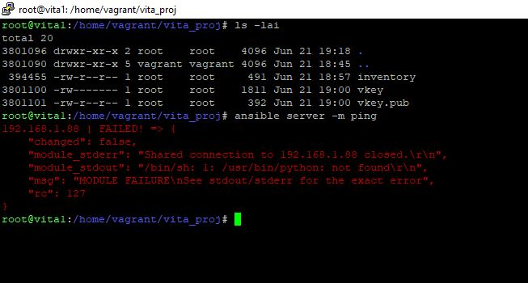

### Тестовое задание на позицию junior dev/ops engineer, Лебедев А. И.    

  


- Я решил объединить задания 1 и 3 в один стэк и попробовать выполнить все используя используя Ansible.
  Машины разверну в virtual box используя vagrant. Можно было бы сделать все это в yzndex cloud и через Terraform, но, считаю, что пока это весьма тернистый путь и давайте исходить из текущих задач.

- Vagrantfile простой. Развернем две машины на Debian10:

```
config.vm.define "vita1" do |vita1|
    vita1.vm.hostname = "vita1"
    vita1.vm.box = "generic/debian10"
    vita1.vm.network "public_network" 
    config.vm.network "public_network", bridge: "Intel(R) Dual Band Wireless-AC 8260"
    config.vm.provider "virtualbox" do |vb|
    vb.memory = "1024"
    vb.cpus = "1"
  end
end


config.vm.define "vita2" do |vita2|
    vita2.vm.hostname = "vita2"
    vita2.vm.box = "generic/debian11"
    vita2.vm.network "public_network"
config.vm.network "public_network", bridge: "Intel(R) Dual Band Wireless-AC 8260"
    config.vm.provider "virtualbox" do |vb|
    vb.memory = "2048"
    vb.cpus = "2"
  end
end
```


На первой машине развернем Ansible, на второй будем разворачивать необходимую по условию инфраструктуру.  

- Запишем адрес необходоимой машины в inventory, создадим и прокинем ssh-ключ (ssh-copy-id -i vkey.pub userid@ip) и попробуем проверить соединение. И вот, о чем я и говорил:

  

Я вижу, что на второй машине есть python, но ансибловый пинг валится в ошибку. Я сталкивался с этим и на яндекс клауде и так и не понял в чем дело. Но, ансибл имеет такой модуль - raw. Собственно, как я понял, им, в основном, такую проблему и решают. Допишем одну строчку в inventory и сделаем raw_playbook.yaml


