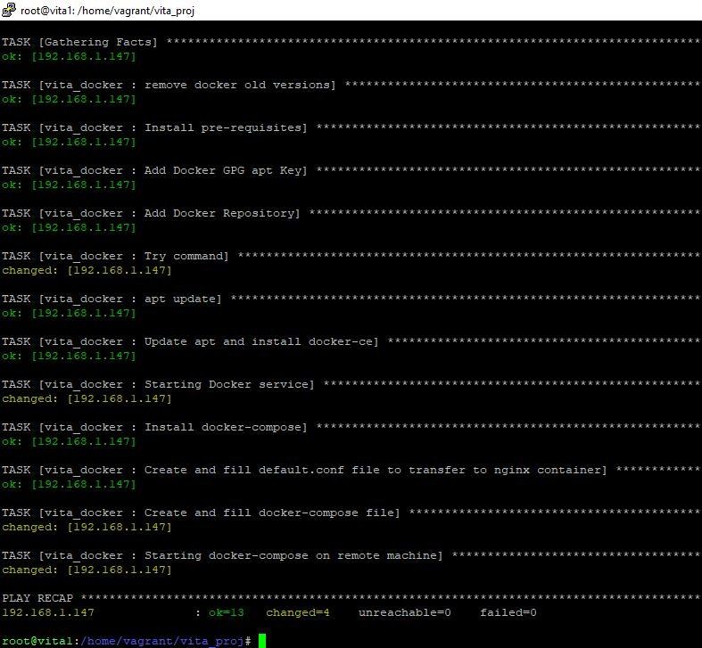
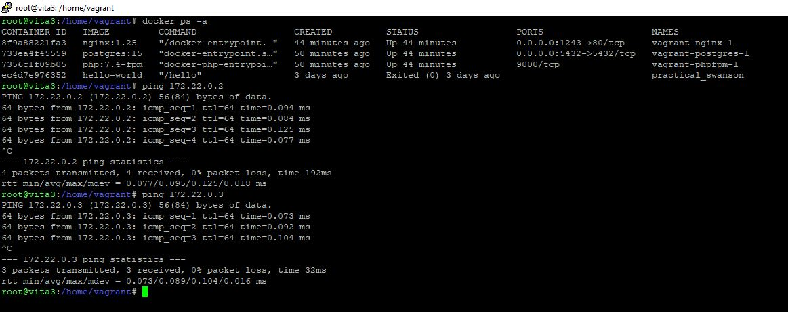
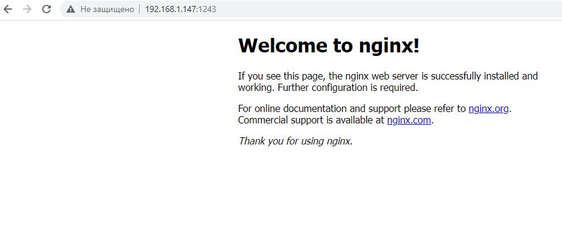

### Тестовое задание на позицию junior dev/ops engineer, Лебедев А. И.      

### Само тестовое задание:  

Привет! Задания не сложные на умение загуглить и понять по условию, что от тебя
хотят. Все сервера linux , поэтому базовые команды по копированию файлов,
подключения по ssh , чтению логов, считаем что знаешь. Результат прислать можно в
ответном файле со скринами и пояснениями , на сколько считаешь достаточным, чем
подробней тем лучше, но без вопросов не обойтись, начнем?  

- ### ansible . Написать простенький ansible-playbook условия.
- структуру папок создать самому :
- в hosts.ini записать группу серверов , группу назвать server
- создать роль copy, в которой есть таска по копирования локальных файлой на
сервера ( server)
- Что использовал, и в чем разница with_items от loop, запустил и что-то не работает
как узнать подробнее?
- ### bash . Написать простенький скрипт, который:
- шебанг баш
- в директории логов ищет внутри файлов слово php7.4 и считает кол-во строк
совпадения
- в коде присутствует счетчик, который с самого начала записывает таймстемп
начала и конца, на основании разницы выводит время( получается что фактически
он считает время работы скрипта)
- вывести результат работы script.sh в другой файл используя только стандартный
поток вывода.
- ### docker. Написать простенький docker-compose файл для запуска
В docker-compose условия.
- 2 сервиса Nginx и PHP имена такие же как сервис
- nginx версия образа 1.25 , порт на внешке 1243, в томе пробросить файл
конфигурации default.conf, по условию ждать пока не запустится контейнер php
- php использовать официальную образ PHP со встроенным FPM версии 7.4,
смонтировать текущий каталог в каталог /var/local/sandboxes/dev/www в контейнере ,
переменную окружения PHP_FPM_LISTEN устанавить 0.0.0.0:9000
* дополнительно, по желанию добавить третьим контенер с базой postgres 15
Чтоб контейнеры в сети докер между собой могли общаться создать сеть с
названием vita в этом же файле docker-compose
Написать команду запуска, если файл default.conf в системе поменяется, изменится
ли он внутри контейнера тоже? Нужен рестарт при изменение файла default.conf ? А
если в docker-compose внесли изменения? Что нравится больше docker-compose или
docker-swarm ?

### Решение:  


  


- Я решил объединить задания 1 и 3 в один стэк и попробовать выполнить все используя используя две роли Ansible - vita_copy и vita_docker.
  Машины разверну в virtual box используя vagrant. Можно было бы сделать все это в yandex cloud и через Terraform, но, считаю, что пока это весьма тернистый путь и давайте исходить из текущих задач.

- Vagrantfile простой. Развернем две машины на Debian 10 и Debian 11 (в дальнейшем, я создал третью машину на Debian 10, ниже указал почему):

```
config.vm.define "vita1" do |vita1|
    vita1.vm.hostname = "vita1"
    vita1.vm.box = "generic/debian10"
    vita1.vm.network "public_network", bridge: "Intel(R) Dual Band Wireless-AC 8260"
    config.vm.provider "virtualbox" do |vb|
    vb.memory = "1024"
    vb.cpus = "1"
  end
end


config.vm.define "vita2" do |vita2|
    vita2.vm.hostname = "vita2"
    vita2.vm.box = "generic/debian11"
    vita2.vm.network "public_network", bridge: "Intel(R) Dual Band Wireless-AC 8260"
    config.vm.provider "virtualbox" do |vb|
    vb.memory = "2048"
    vb.cpus = "2"
  end
end
```


На первой машине развернем Ansible, на второй будем разворачивать необходимую по условию инфраструктуру.  

- Запишем адрес необходоимой машины в inventory, создадим и прокинем ssh-ключ (*ssh-copy-id -i vkey.pub userid@ip*) и попробуем проверить соединение. И вот, о чем я и говорил:

  

Я вижу, что на второй машине есть python, но ансибловый пинг валится в ошибку. Я сталкивался с этим и на яндекс клауде и так и не понял в чем дело. Но, ансибл имеет такой модуль - raw. Собственно, как я понял, им, в основном, такую проблему и решают. Допишем одну строчку в inventory и сделаем *raw_playbook.yaml*.  
  
Собственно, после этого связь появляется и все ок. Я не знаю, что это за баг. У кого не спрашивал, никто не сталкивался. Возможно, я что-то делаю не правильно:    

    

- Закачаем пустую структуру ansible-galaxy, чтобы выполнить все одной ролью, ну и напишем плэйбук, собственно (все файлы и структура доступны в данном гите):

```
root@vita1:/home/vagrant/vita_proj# ansible-playbook vita_copy.yaml

PLAY [server] *******************************************************************************************************************************************************************************************************************************

TASK [Gathering Facts] **********************************************************************************************************************************************************************************************************************
ok: [10.22.97.60]

TASK [vita_copy : Create parent directory] **************************************************************************************************************************************************************************************************
ok: [10.22.97.60]

TASK [vita_copy : Create subdirectories] ****************************************************************************************************************************************************************************************************
ok: [10.22.97.60] => (item=/home/vagrant/workdir/codes)
ok: [10.22.97.60] => (item=/home/vagrant/workdir/tests)
ok: [10.22.97.60] => (item=/home/vagrant/workdir/prod)

TASK [vita_copy : Put random bash-scripts1 to codes directory] ******************************************************************************************************************************************************************************
ok: [10.22.97.60]

TASK [vita_copy : Put random bash-scripts2 to codes directory] ******************************************************************************************************************************************************************************
ok: [10.22.97.60]

TASK [vita_copy : Copy directory using copy module] *****************************************************************************************************************************************************************************************
ok: [10.22.97.60]

TASK [vita_copy : Copy files using copy module] *********************************************************************************************************************************************************************************************
ok: [10.22.97.60] => (item=randomfile1)
ok: [10.22.97.60] => (item=randomfile2)
ok: [10.22.97.60] => (item=randomfile3)
ok: [10.22.97.60] => (item=randomfile4)

TASK [vita_copy : Check created folders and files] ******************************************************************************************************************************************************************************************
changed: [10.22.97.60] => (item=/home/vagrant/workdir)
changed: [10.22.97.60] => (item=/home/vagrant/workdir/codes)
changed: [10.22.97.60] => (item=/home/vagrant/workdir/tests)
changed: [10.22.97.60] => (item=/home/vagrant/workdir/prod)

TASK [vita_copy : Out_files] ****************************************************************************************************************************************************************************************************************
ok: [10.22.97.60] => {
    "msg": "####Созданные файлы и каталоги####"
}

TASK [vita_copy : Out_result] ***************************************************************************************************************************************************************************************************************
ok: [10.22.97.60] => {
    "result": {
        "changed": true,
        "msg": "All items completed",
        "results": [
            {
                "_ansible_ignore_errors": true,
                "_ansible_item_label": "/home/vagrant/workdir",
                "_ansible_item_result": true,
                "_ansible_no_log": false,
                "_ansible_parsed": true,
                "changed": true,
                "cmd": [
                    "ls",
                    "/home/vagrant/workdir"
                ],
                "delta": "0:00:01.006068",
                "end": "2023-06-22 11:29:24.814663",
                "failed": false,
                "invocation": {
                    "module_args": {
                        "_raw_params": "ls \"/home/vagrant/workdir\"",
                        "_uses_shell": false,
                        "argv": null,
                        "chdir": null,
                        "creates": null,
                        "executable": null,
                        "removes": null,
                        "stdin": null,
                        "warn": true
                    }
                },
                "item": "/home/vagrant/workdir",
                "rc": 0,
                "start": "2023-06-22 11:29:23.808595",
                "stderr": "",
                "stderr_lines": [],
                "stdout": "codes\nprod\ntests",
                "stdout_lines": [
                    "codes",
                    "prod",
                    "tests"
                ]
            },
            {
                "_ansible_ignore_errors": true,
                "_ansible_item_label": "/home/vagrant/workdir/codes",
                "_ansible_item_result": true,
                "_ansible_no_log": false,
                "_ansible_parsed": true,
                "changed": true,
                "cmd": [
                    "ls",
                    "/home/vagrant/workdir/codes"
                ],
                "delta": "0:00:00.003848",
                "end": "2023-06-22 11:29:25.175921",
                "failed": false,
                "invocation": {
                    "module_args": {
                        "_raw_params": "ls \"/home/vagrant/workdir/codes\"",
                        "_uses_shell": false,
                        "argv": null,
                        "chdir": null,
                        "creates": null,
                        "executable": null,
                        "removes": null,
                        "stdin": null,
                        "warn": true
                    }
                },
                "item": "/home/vagrant/workdir/codes",
                "rc": 0,
                "start": "2023-06-22 11:29:25.172073",
                "stderr": "",
                "stderr_lines": [],
                "stdout": "script1.sh\nscript2.sh",
                "stdout_lines": [
                    "script1.sh",
                    "script2.sh"
                ]
            },
            {
                "_ansible_ignore_errors": true,
                "_ansible_item_label": "/home/vagrant/workdir/tests",
                "_ansible_item_result": true,
                "_ansible_no_log": false,
                "_ansible_parsed": true,
                "changed": true,
                "cmd": [
                    "ls",
                    "/home/vagrant/workdir/tests"
                ],
                "delta": "0:00:00.004912",
                "end": "2023-06-22 11:29:25.520529",
                "failed": false,
                "invocation": {
                    "module_args": {
                        "_raw_params": "ls \"/home/vagrant/workdir/tests\"",
                        "_uses_shell": false,
                        "argv": null,
                        "chdir": null,
                        "creates": null,
                        "executable": null,
                        "removes": null,
                        "stdin": null,
                        "warn": true
                    }
                },
                "item": "/home/vagrant/workdir/tests",
                "rc": 0,
                "start": "2023-06-22 11:29:25.515617",
                "stderr": "",
                "stderr_lines": [],
                "stdout": "randomdir",
                "stdout_lines": [
                    "randomdir"
                ]
            },
            {
                "_ansible_ignore_errors": true,
                "_ansible_item_label": "/home/vagrant/workdir/prod",
                "_ansible_item_result": true,
                "_ansible_no_log": false,
                "_ansible_parsed": true,
                "changed": true,
                "cmd": [
                    "ls",
                    "/home/vagrant/workdir/prod"
                ],
                "delta": "0:00:00.003558",
                "end": "2023-06-22 11:29:25.859104",
                "failed": false,
                "invocation": {
                    "module_args": {
                        "_raw_params": "ls \"/home/vagrant/workdir/prod\"",
                        "_uses_shell": false,
                        "argv": null,
                        "chdir": null,
                        "creates": null,
                        "executable": null,
                        "removes": null,
                        "stdin": null,
                        "warn": true
                    }
                },
                "item": "/home/vagrant/workdir/prod",
                "rc": 0,
                "start": "2023-06-22 11:29:25.855546",
                "stderr": "",
                "stderr_lines": [],
                "stdout": "randomfile1\nrandomfile2\nrandomfile3\nrandomfile4",
                "stdout_lines": [
                    "randomfile1",
                    "randomfile2",
                    "randomfile3",
                    "randomfile4"
                ]
            }
        ]
    }
}

TASK [vita_copy : Check content] ************************************************************************************************************************************************************************************************************
changed: [10.22.97.60] => (item=/home/vagrant/workdir/codes/script1.sh)
changed: [10.22.97.60] => (item=/home/vagrant/workdir/codes/script2.sh)

TASK [vita_copy : Out_code] *****************************************************************************************************************************************************************************************************************
ok: [10.22.97.60] => {
    "msg": "####Содержимое файлов со скриптами####"
}

TASK [vita_copy : Out_code_result] **********************************************************************************************************************************************************************************************************
ok: [10.22.97.60] => {
    "resultcode": {
        "changed": true,
        "msg": "All items completed",
        "results": [
            {
                "_ansible_ignore_errors": true,
                "_ansible_item_label": "/home/vagrant/workdir/codes/script1.sh",
                "_ansible_item_result": true,
                "_ansible_no_log": false,
                "_ansible_parsed": true,
                "changed": true,
                "cmd": [
                    "cat",
                    "/home/vagrant/workdir/codes/script1.sh"
                ],
                "delta": "0:00:00.004077",
                "end": "2023-06-22 11:29:26.434841",
                "failed": false,
                "invocation": {
                    "module_args": {
                        "_raw_params": "cat \"/home/vagrant/workdir/codes/script1.sh\"",
                        "_uses_shell": false,
                        "argv": null,
                        "chdir": null,
                        "creates": null,
                        "executable": null,
                        "removes": null,
                        "stdin": null,
                        "warn": true
                    }
                },
                "item": "/home/vagrant/workdir/codes/script1.sh",
                "rc": 0,
                "start": "2023-06-22 11:29:26.430764",
                "stderr": "",
                "stderr_lines": [],
                "stdout": "#!/bin/bash\n# Generate a randomly based range defined by the user\n\n#Take the lower and the upper value from the user\necho \"Enter the minimum value:\"\nread minimum\necho \"Enter the maximum value:\"\nread maximum\n\n#Check the taken values are valid\nif [[ $maximum < $minimum ]]; then\n    echo \"Maximum value can't be lower than minimum value\"\n    exit 1\nfi\n\n#Find out the difference between the numbers\ndiff=$(($maximum-$minimum))\n\n#Check the difference value\nif [[ $diff == 1 ]]; then\n    echo \"The range of numbers must be more than 1\"\n    exit 1\nfi\n\n#Generate the random number\nrandomNumber=$(($minimum + $RANDOM % $maximum))\n#Print the generated number\necho \"The generated random number is: $randomNumber\"",
                "stdout_lines": [
                    "#!/bin/bash",
                    "# Generate a randomly based range defined by the user",
                    "",
                    "#Take the lower and the upper value from the user",
                    "echo \"Enter the minimum value:\"",
                    "read minimum",
                    "echo \"Enter the maximum value:\"",
                    "read maximum",
                    "",
                    "#Check the taken values are valid",
                    "if [[ $maximum < $minimum ]]; then",
                    "    echo \"Maximum value can't be lower than minimum value\"",
                    "    exit 1",
                    "fi",
                    "",
                    "#Find out the difference between the numbers",
                    "diff=$(($maximum-$minimum))",
                    "",
                    "#Check the difference value",
                    "if [[ $diff == 1 ]]; then",
                    "    echo \"The range of numbers must be more than 1\"",
                    "    exit 1",
                    "fi",
                    "",
                    "#Generate the random number",
                    "randomNumber=$(($minimum + $RANDOM % $maximum))",
                    "#Print the generated number",
                    "echo \"The generated random number is: $randomNumber\""
                ]
            },
            {
                "_ansible_ignore_errors": true,
                "_ansible_item_label": "/home/vagrant/workdir/codes/script2.sh",
                "_ansible_item_result": true,
                "_ansible_no_log": false,
                "_ansible_parsed": true,
                "changed": true,
                "cmd": [
                    "cat",
                    "/home/vagrant/workdir/codes/script2.sh"
                ],
                "delta": "0:00:00.003282",
                "end": "2023-06-22 11:29:26.807814",
                "failed": false,
                "invocation": {
                    "module_args": {
                        "_raw_params": "cat \"/home/vagrant/workdir/codes/script2.sh\"",
                        "_uses_shell": false,
                        "argv": null,
                        "chdir": null,
                        "creates": null,
                        "executable": null,
                        "removes": null,
                        "stdin": null,
                        "warn": true
                    }
                },
                "item": "/home/vagrant/workdir/codes/script2.sh",
                "rc": 0,
                "start": "2023-06-22 11:29:26.804532",
                "stderr": "",
                "stderr_lines": [],
                "stdout": "#!/bin/bash\n\necho -n \"Let's play a game: Pick a number between 0 and 32767: \"\nread a\nif (( RANDOM == a )); then\n   echo AMAZING, your answer is correct\nelse\n   echo Sorry, that was wrong\nfi",
                "stdout_lines": [
                    "#!/bin/bash",
                    "",
                    "echo -n \"Let's play a game: Pick a number between 0 and 32767: \"",
                    "read a",
                    "if (( RANDOM == a )); then",
                    "   echo AMAZING, your answer is correct",
                    "else",
                    "   echo Sorry, that was wrong",
                    "fi"
                ]
            }
        ]
    }
}

PLAY RECAP **********************************************************************************************************************************************************************************************************************************
10.22.97.60                : ok=13   changed=2    unreachable=0    failed=0

root@vita1:/home/vagrant/vita_proj#
```


### Комментарии  

- Что я могу сказать. Т.к. структуру папок до этого ансиблом я не раскидывал - читать пришлось много. Модуль copy, оказывается не знает параметр recusrsive и я долго разбирался, чем заменить. В итоге, заменил на synchronize. Далее, я захотел добавить красоты и вывести все, что создалось и содержимое файлов в терминал, но до конца победить не смог и у меня лезет огромная простыня из которой, в принципе, можно вычленить нужное, но не так легко, как это хотел видеть я. Пробовал дописывать в var вот в таком виде - *result.stdout_lines*, что кажется логичным, но так не выходит.

- Относительно различий между *loop* и *with_items*. Если честно, я для себя их особо не нашел. Да, пишут, что *with_items* сейчас уже не используют почти и в сравнении с *loop* там чуть другой синтаксис, но я попробовал и то и другое и разницы для себя (пока) не увидел совсем. Использовал loop.  

- Относительно того, что "запустил и не работает". Запустил что? Плэйбук. Там можно понять на каком шаге и уже смотреть подробнее. Также, если я не ошибаюсь, можно использовать *-vvv* для более подробного отображения выполнения плэйбука. Ну и синтаксис yaml-файла можно тоже проверить через --syntax-check. 


### Задание 3 - пробуем раскатать и запустить контейнеры на удаленной машине.  

- Что ж. Тут все было, с одной стороны, чуть сложнее, но немного интереснее. Начнем с того, что на удаленной машине у меня был установлен Debian 11 и мой плэйбук падал на шаге добавления репозитория под доккер. Из-за этого факта плэйбук получился немного сумбурным, т.к. я пробовал разные конфигурации. Но не помогало ничего. Я специально оставил и не удалял из плэйбука ничего, чтобы вы понимали, что и как я пытался делать. Я подсмотрел у кого-то переменные и использовал их, я пытался добавить репозиторий, тупо, командой. Потратил на это все много времени, а потом...поставил Debian 10 и все позеленело.

- Итак, чтобы сделать все в один клик, я добавил 2 файла в тимплэйты. Первый - это default.conf (взял стандартный файл из интернета), второй же - это, собственно, docker-compose.yaml, который будет у нас разворачивать три необходимых нам контейнера на удаленной машине:  

```
version: "3"

#Устанавливаем nginx, прокидываем порт, закидываем нашу конфигурацию, назначаем адрес из созданной подсети
services:
  nginx:
    image: nginx:1.25
    ports:
      - 1243:80
    volumes:
      - ./default.conf:/etc/nginx/conf.d/default.conf
    networks:
      vita:
        ipv4_address: 172.22.0.4
    depends_on:
      - phpfpm
    restart: always

#Устанавливаем PHP-FPM (если честно, до этого не имел с ним дел и даже не знал, что это), прокидываем текущую директорию в нужную, задаем необходимую переменную среды и добавляем подсеть
  phpfpm:
    image: php:7.4-fpm
    volumes:
      - ./:/var/local/sandboxes/dev/www
    environment:
      - PHP_FPM_LISTEN=0.0.0.0:9000
    networks:
      vita:
        ipv4_address: 172.22.0.2
    restart: always

# Здесь условий особо не было по заданию, но я добавил базу
  postgres:
    image: postgres:15
    ports:
      - 5432:5432
    environment:
      POSTGRES_PASSWORD: 12345
      POSTGRES_DB: vita
    networks:
      vita:
        ipv4_address: 172.22.0.3
    restart: always

#Собственно, сеть для межконтейнерного взаимодействия
networks:
  vita:
    driver: bridge
    name: vita-network
    ipam:
      config:
        - subnet: 172.22.0.0/24

```


- Что ж, запускаем (конечно, запускаю я уже не первый раз, но так работает финальная версия). На этот раз давайте без простыни, а просто скриншот. И не буду, пожалуй, пытаться затянуть итоги в вывод ансибла, а посмотрим их, просто, на удаленной машине:

  


      


     


- Вы спрашиваете: *если файл default.conf в системе поменяется, изменится ли он внутри контейнера тоже? Нужен рестарт при изменение файла default.conf ? А если в docker-compose внесли изменения?* Мой ответ такой - когда мы пробрасываем директорию или файл, то контейнер работает с этой директорией или файлом и, если мы меняем что-то в проброшенном файле или каталоге с любой из сторон - данные изменятся. Рестарт контейнера при этом не нужен. Я могу быть не прав, т.к. шпаргалку я не смотрел и у нас была только одна вводная лекция по доккеру и доккер-компоузу, а все нюансы я пока изучаю у себя в "песочнице" в качестве факультатива.

- Относительно доккер-сворм. У меня не было опыта работы с ним. Нас пытаются загнать сразу в k8s минуя его. Но, я точно знаю, что доккер-сворм используется для кластеризации контейнеров на нескольких машинах, а доккер-компоуз мы можем использовать только в рамках одной машины. Корректно ли их сравнивать? Возможно, я еще чего-то не знаю и доккер-сворм, также, можно использовать для разворота контейнеров на одной машине и, возможно, это удобнее. Пока не могу знать.


### Задание про bash-скрипт  

- Признаюсь, что оно было для меня самым сложным. К тому, что я делаю в этом тестовом задании, я, все же, пришел из системного администрирования и всегда обходил программирование стороной. Bash мне очень нравится. Т.к. это интерпретатор, в него можно завернуть вообще все, но, дается он мне пока не легко. Но, я думаю, это все можно наверстать.
Итак, вот какой вышел скрипт:  

```
#!/bin/bash
#Beginning time
starting=$(date +%s)
#Looking for "php7.4" in our logs:
grep -r "php7.4" /var/log/
#Ending time
ending=$(date +%s)
#Checking execution time
total=$((ending - starting))
#Echo
echo "Время работы скрипта: $total сек."

```  

Завернем в стандартный вывод:  

```
root@vita3:/home/vagrant# sh script.sh > result
root@vita3:/home/vagrant# cat result
0
Время работы скрипта: 0 сек.
```


Ни находит ни одной строчки (*так, ребята, кажется, нашел косяк в скрипте, вечером доберусь до компа и проверю. Вероятно, не ищет, потому что я не экоанировал точку*). Если заменить php7.4 просто на php - находиv строки:  

```
root@vita3:/home/vagrant# sh script.sh > result
root@vita3:/home/vagrant# cat result
/var/log/kern.log:Jul 10 07:03:25 vita3 kernel: [    0.691056] acpiphp: ACPI Hot Plug PCI Controller Driver version: 0.5
/var/log/messages:Jul 10 07:03:25 vita3 kernel: [    0.691056] acpiphp: ACPI Hot Plug PCI Controller Driver version: 0.5
/var/log/kern.log.1:Feb 15 03:54:15 debian kernel: [    0.465104] acpiphp: ACPI Hot Plug PCI Controller Driver version: 0.5
/var/log/kern.log.1:Jun 22 19:23:08 debian10 kernel: [    1.055344] acpiphp: ACPI Hot Plug PCI Controller Driver version: 0.5
/var/log/kern.log.1:Jul  4 12:07:51 vita3 kernel: [    0.625623] acpiphp: ACPI Hot Plug PCI Controller Driver version: 0.5
/var/log/syslog.1:Jul 10 07:03:25 vita3 kernel: [    0.691056] acpiphp: ACPI Hot Plug PCI Controller Driver version: 0.5
/var/log/messages.1:Feb 15 03:54:15 debian kernel: [    0.465104] acpiphp: ACPI Hot Plug PCI Controller Driver version: 0.5
/var/log/messages.1:Jun 22 19:23:08 debian10 kernel: [    1.055344] acpiphp: ACPI Hot Plug PCI Controller Driver version: 0.5
/var/log/messages.1:Jul  4 12:07:51 vita3 kernel: [    0.625623] acpiphp: ACPI Hot Plug PCI Controller Driver version: 0.5
Время работы скрипта: 0 сек.

```

Прошу написать, если нужны какие-то дополнения, комментарии и прочее.  

Всю структуру работы я положил в этот git - репозиторий для вашего удобства. Не стал класть только ansible.cfg, но там раскомментировал только одну строчку - путь к файлу inventory.  

Старался сделать, как можно быстрее. Прошу прощения, если где-то вышло сумбурно или я что-то забыл.  
 


